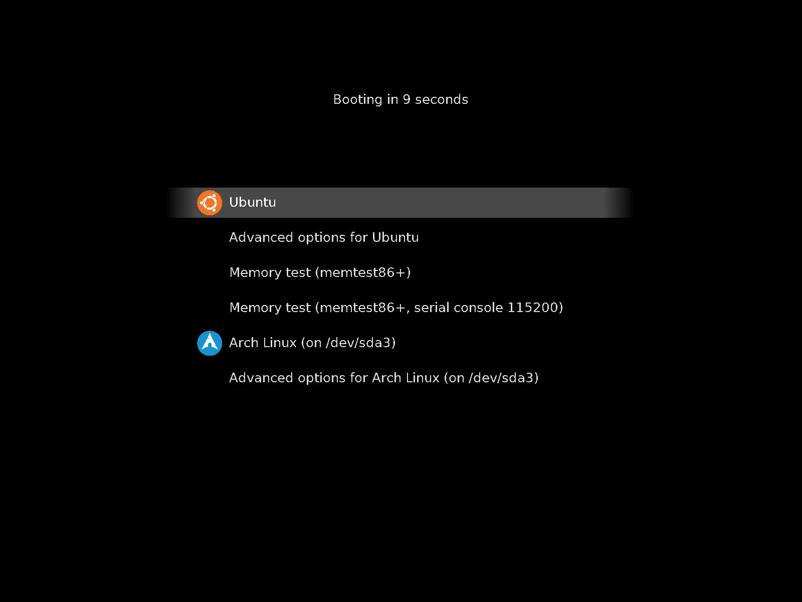

# Primitivistical, a theme for grub

[Grub](https://www.gnu.org/software/grub/) is a boot loader: it detects
any operating system on your computer and loads the one you select.

This theme has a minimalistic, black screen. Options are highlighted in
a grey box and have colored icons.

To install, download and run the ``Install.sh`` script.

# Screenshot

# Credits

The [UbuntuMate logo](https://github.com/ubuntu-mate/brand-artwork) is made
available under [CC BY-SA 4.0](https://creativecommons.org/licenses/by-sa/4.0/).
The Archlinux, Debian, Fedora, Gentoo, Kubuntu, Linux Mint, Opensuse and
Ubuntu logos by [Aha-Soft](https://www.iconfinder.com/iconsets/flat-round-system)
are licensed under [CC BY 2.0](https://creativecommons.org/licenses/by/3.0/).
